# 🎵 Rhythm Editor

**Tales of Bori** 리듬 게임을 위한 전문 악보 편집 및 관리 시스템

<div align="center">


</div>

---

## 📑 목차

1. [📖 프로젝트 소개](#-프로젝트-소개)
2. [🖼️ 스크린샷](#️-스크린샷)
3. [🏗️ 기술 스택](#️-기술-스택)
4. [🎯 핵심 기능](#-핵심-기능)<br/>
  4.1. [🎼 Editor 모드 (악보 편집)](#1--editor-모드-악보-편집)<br/>
  4.2. [👨‍💼 Admin 모드 (관리자 대시보드)](#2--admin-모드-관리자-대시보드)<br/>
  4.3. [🔐 인증 시스템](#3--인증-시스템)
5. [📊 시스템 아키텍처](#-시스템-아키텍처)
6. [🗂️ 프로젝트 구조](#️-프로젝트-구조)
7. [🔧 데이터 모델](#-데이터-모델)
8. [🚀 주요 기술 구현](#-주요-기술-구현)
9. [🔐 보안 고려사항](#-보안-고려사항)
10. [📈 모니터링 및 디버깅](#-모니터링-및-디버깅)
11. [📝 사용 가이드](#-사용-가이드)
12. [🛠️ 개발 환경 설정](#️-개발-환경-설정)
13. [🏢 배포 및 운영](#-배포-및-운영)
14. [🔧 트러블슈팅](#-트러블슈팅)
15. [📚 개발자 온보딩 가이드](#-개발자-온보딩-가이드)
16. [🏛️ 아키텍처 의사결정 기록](#️-아키텍처-의사결정-기록)
17. [⚡ 성능 최적화 가이드](#-성능-최적화-가이드)
18. [⚠️ 알려진 이슈 및 제한사항](#️-알려진-이슈-및-제한사항)
19. [🧪 테스트 가이드](#-테스트-가이드)
20. [👥 코드 소유권 및 리뷰 가이드](#-코드-소유권-및-리뷰-가이드)
21. [🔄 Git 워크플로우](#-git-워크플로우)
22. [📦 배포 체크리스트](#-배포-체크리스트)
23. [📞 문의 및 지원](#-문의-및-지원)
24. [📜 라이센스](#-라이센스)

---

## 📖 프로젝트 소개

Rhythm Editor는 리듬 게임 "Tales of Bori"의 악보 데이터를 생성, 편집, 관리하기 위한 Unreal Engine 기반 데스크톱 애플리케이션입니다. 직관적인 GUI를 통해 음악 파일에 맞춰 정확한 비트맵을 제작하고, 서버와의 실시간 동기화를 통해 효율적인 콘텐츠 관리를 지원합니다.
※ 사내 보안에 따라 소스 코드를 비공개하였으며, 상세 아키텍처는 해당 README 문서를 통해 파악 가능합니다.

### 주요 특징

- **실시간 악보 편집**: 오디오 재생과 동기화된 비트 단위 노트 배치
- **역할 기반 접근 제어**: Admin/Editor 권한에 따른 차별화된 기능 제공
- **클라우드 연동**: 내부 스토리지 서버를 통한 안전한 파일 저장 및 관리
- **보안 인증 시스템**: JWT 기반 토큰 인증 및 AES 암호화
- **관리자 대시보드**: 곡/유저/로그 통합 관리 시스템
- **다중 난이도 지원**: Easy/Normal/Hard/Crazy 4단계 난이도 설정
- **곡 버전 관리**: Main/Sub/Take 3단계 버전 체계

---

## 🖼️ 스크린샷

### Editor 모드 - 악보 편집 인터페이스


*실시간 오디오 재생과 함께 비트 단위로 노트를 배치하고 편집할 수 있는 직관적인 인터페이스*

### Admin 모드 - 곡 관리 대시보드


*곡 메타데이터 관리, 검색, 필터링, 버전 관리를 위한 통합 대시보드*

---

## 🏗️ 기술 스택

### Core Technology
- **Engine**: Unreal Engine 5.4.4
- **Language**: C++ (Core Logic) + Blueprint (UI/Workflow)
- **Platform**: Windows Desktop

### Backend Integration
- **Authentication**: JWT (Access Token + Refresh Token)
- **Storage**: 자체 구축 파일 스토리지 서버 (Presigned URL 기반)
- **API Communication**: RESTful HTTP (JSON)
- **Security**: AES-256 Encryption for token persistence

### Key Libraries & Modules
- **Audio Processing**: USoundWaveProcedural, UAudioComponent
- **HTTP Client**: Unreal HTTP Module
- **UI Framework**: UMG (Unreal Motion Graphics)
- **File I/O**: FFileHelper, FJsonSerializer

---

## 🎯 핵심 기능

### 1. 🎼 Editor 모드 (악보 편집)

#### 프로젝트 생성 및 관리
- 서버에서 곡 목록 조회 및 선택
- Main 버전 선택, 난이도 설정
- 자동 Sub/Take 버전 할당
- 로컬 프로젝트 저장/불러오기

#### 악보 편집 기능
- **입력 모드**: 키보드 입력(1-6)을 통한 6가지 노트 타입 배치
- **이동 모드**: 트랙 단위 드래그로 타이밍 조정
- **그리드 해상도**: Quarter/8th/16th/32nd/64th Note 선택
- **실시간 재생**: 오디오 재생과 동기화된 시각적 피드백
- **다중 트랙 관리**: 트랙 추가/삭제, 다중 선택 및 일괄 편집

#### 서버 연동
- 오디오 파일 자동 다운로드 (Presigned URL)
- 편집 완료된 악보 업로드 (Core + Tracks JSON)
- 버전별 악보 데이터 조회

### 2. 👨‍💼 Admin 모드 (관리자 대시보드)

#### 곡 관리 (Song Management)
- **CRUD 작업**: 곡 생성/조회/수정/삭제
- **메타데이터 관리**: 제목(KR/EN), BPM, 박자, 버전 정보
- **파일 업로드**: 오디오(WAV) 및 이미지 파일 관리
- **버전 관리**: 
  - Main/Sub 버전 시스템
  - 덮어쓰기 또는 새 Sub 버전 생성
  - Take 버전 자동 관리
- **다운로드**: NoteMap(JSON) 및 Audio(WAV) 다운로드
- **페이징 & 필터링**: 제목 검색, 정렬, 페이지네이션

#### 사용자 관리 (User Management)
- 사용자 목록 조회 (페이징)
- 사용자 정보 수정 (ID/Password/Role)
- 사용자 삭제 (확인 절차 포함)
- 역할 기반 권한 제어 (Admin/Editor/Guest)

#### 로그 관리 (Log Viewer)
- 무한 스크롤 기반 로그 조회
- 곡 업로드/수정 이력 추적
- 버전별 변경 내역 확인

### 3. 🔐 인증 시스템

#### 로그인/회원가입
- ID 정책: 8-20자 영문
- Password 정책: 특수문자 포함
- JWT 기반 토큰 발급

#### 세션 관리
- Access Token (메모리)
- Refresh Token (AES 암호화 후 Game.ini 저장)
- 자동 토큰 갱신
- 앱 종료 시 동기 로그아웃 (3초 타임아웃)

---

## 📊 시스템 아키텍처

### 앱 플로우 차트 (Simplified)


### 클래스 다이어그램 (Simplified)


### 서버 통신 플로우 (Client)


<details>
<summary><b>📋 상세 플로우차트 보기</b></summary>

### 리듬 에디터 상세 앱 플로우 차트

```mermaid
flowchart TD
    Start([앱 시작]) --> Login[LoginWidget 표시]
    
    Login --> UserChoice{사용자 선택}
    UserChoice -->|로그인| InputCred[ID/Password 입력]
    UserChoice -->|회원가입| SignUp[SignUpWidget 열기]
    
    %% 회원가입 플로우
    SignUp --> SignUpInput[ID/Password 입력]
    SignUpInput --> PolicyCheck{정책 검증}
    PolicyCheck -->|실패<br/>8-20자 영문<br/>PW 특수문자| SignUpError[에러 표시]
    SignUpError --> SignUp
    PolicyCheck -->|성공| RegisterAPI[서버 회원가입 API]
    RegisterAPI --> RegisterResult{가입 성공?}
    RegisterResult -->|실패| SignUpError
    RegisterResult -->|성공| Login
    
    %% 로그인 플로우
    InputCred --> LoginAPI[서버 로그인 API]
    LoginAPI --> LoginResult{로그인 성공?}
    LoginResult -->|실패| LoginError[에러 표시]
    LoginError --> Login
    
    LoginResult -->|성공| SaveSession[세션 저장<br/>AccessToken, RefreshToken<br/>UserId, Role]
    SaveSession --> RoleCheck{Role 확인}
    
    RoleCheck -->|Admin| AdminEntry[👨‍💼 Admin 모드 진입]
    RoleCheck -->|Editor| EditorEntry[✏️ Editor 모드 진입]
    RoleCheck -->|Guest| AccessDenied[권한 없음]
    AccessDenied --> Login

    %% ========================================
    %% ADMIN 모드 영역
    %% ========================================
    
    AdminEntry --> AdminMode[AdminDashboardWidget]
    AdminMode --> AdminTabs{탭 선택}
    AdminTabs -->|곡 관리| SongTab[SongManagementWidget]
    AdminTabs -->|로그 관리| LogTab[LogViewerWidget]
    AdminTabs -->|유저 관리| UserTab[UserManagementWidget]
    AdminTabs -->|로그아웃| AdminLogout[Admin 로그아웃]

    %% === 곡 관리 탭 ===
    SongTab --> SongList[곡 목록 조회<br/>페이징/정렬/필터]
    SongList --> SongAction{액션 선택}
    
    SongAction -->|생성| CreateSong[SongCreateDialogWidget]
    SongAction -->|조회| InfoSong[SongInfoDialogWidget]
    SongAction -->|목록 복귀| SongList
    
    CreateSong --> InputSongMeta[제목KR/EN, BPM<br/>박자, 메인버전 입력]
    InputSongMeta --> PickFiles[오디오/이미지 선택]
    PickFiles --> CreateSubmit[서버 생성 요청]
    CreateSubmit --> GetPresigned1[Presigned URL 받기]
    GetPresigned1 --> UploadAudio[오디오 PUT to Storage]
    UploadAudio --> UploadImage[이미지 PUT to Storage]
    UploadImage --> CreateDone[생성 완료]
    CreateDone --> SongList
    
    InfoSong --> InfoActions{액션 선택}
    InfoActions -->|수정| EditSong[SongEditDialogWidget]
    InfoActions -->|업데이트| UpdateSong[SongUpdateDialogWidget]
    InfoActions -->|삭제| DeleteSong[SongDeleteDialogWidget]
    InfoActions -->|다운로드| DownloadMode[다운로드 모드]
    InfoActions -->|닫기| SongList
    
    EditSong --> EditMeta[BPM/박자 수정]
    EditMeta --> SaveEdit[서버 업데이트]
    SaveEdit --> SongList
    
    UpdateSong --> UpdateChoice{덮어쓰기?}
    UpdateChoice -->|새 서브버전| NewSub[Sub + 1]
    UpdateChoice -->|덮어쓰기| Overwrite[현재 Sub 유지]
    NewSub --> PickUpdateFiles[오디오/이미지 선택]
    Overwrite --> ConfirmOverwrite{확인}
    ConfirmOverwrite -->|취소| UpdateSong
    ConfirmOverwrite -->|확인| PickUpdateFiles
    PickUpdateFiles --> UpdateSubmit[서버 업데이트 요청]
    UpdateSubmit --> GetPresigned2[Presigned URL 받기]
    GetPresigned2 --> UploadAudio2[오디오 PUT to Storage]
    UploadAudio2 --> UploadImage2[이미지 PUT to Storage]
    UploadImage2 --> UpdateDone[업데이트 완료]
    UpdateDone --> SongList
    
    DeleteSong --> ConfirmDelete[제목+버전 확인 입력]
    ConfirmDelete --> DeleteSubmit{확인 일치?}
    DeleteSubmit -->|불일치| DeleteError[에러 표시]
    DeleteError --> DeleteSong
    DeleteSubmit -->|일치| DeleteAPI[서버 삭제 요청]
    DeleteAPI --> DeleteDone[삭제 완료]
    DeleteDone --> SongList
    
    DownloadMode --> SelectVersion[Main/Sub/Take 선택]
    SelectVersion --> SelectDiff[난이도 선택<br/>Easy/Normal/Hard/Crazy]
    SelectDiff --> DownloadWhat{다운로드 대상}
    DownloadWhat -->|NoteMap| DownloadNote[Presigned URL 요청<br/>JSON 다운로드]
    DownloadWhat -->|Audio| DownloadAudio[Presigned URL 요청<br/>WAV 다운로드]
    DownloadNote --> InfoSong
    DownloadAudio --> InfoSong
    
    %% === 로그 관리 탭 ===
    LogTab --> LogList[로그 목록 조회<br/>무한 스크롤]
    LogList --> LogMore{더보기?}
    LogMore -->|예| LoadMore[다음 페이지 로드]
    LoadMore --> LogList
    LogMore -->|탭 전환| AdminTabs
    
    %% === 유저 관리 탭 ===
    UserTab --> UserList[유저 목록 조회<br/>페이징]
    UserList --> UserAction{액션 선택}
    UserAction -->|수정| EditUser[UserEditDialogWidget]
    UserAction -->|삭제| DeleteUser[UserDeleteDialogWidget]
    UserAction -->|목록 복귀| UserList
    
    EditUser --> EditUserData[ID/PW/Role 수정]
    EditUserData --> SaveUser[서버 업데이트]
    SaveUser --> UserList
    
    DeleteUser --> ConfirmDeleteUser[ID/Password 확인 입력]
    ConfirmDeleteUser --> DeleteUserSubmit{확인 일치?}
    DeleteUserSubmit -->|불일치| DeleteUserError[에러 표시]
    DeleteUserError --> DeleteUser
    DeleteUserSubmit -->|일치| DeleteUserAPI[서버 삭제 요청]
    DeleteUserAPI --> DeleteUserDone[삭제 완료]
    DeleteUserDone --> UserList

    %% Admin 로그아웃
    AdminLogout --> AdminLogoutAPI[서버 로그아웃 API]
    AdminLogoutAPI --> AdminClearSession[세션 정리]
    AdminClearSession --> AdminRemoveToken[디스크 토큰 삭제]
    AdminRemoveToken --> Login

    %% Admin 종료
    AdminMode --> AdminExit{종료 이벤트}
    AdminExit --> AdminSyncLogout[동기 로그아웃]
    AdminSyncLogout --> AdminCleanup[세션/토큰 정리]
    AdminCleanup --> End([앱 종료])

    %% ========================================
    %% EDITOR 모드 영역
    %% ========================================
    
    EditorEntry --> EditorMode[EditorMainWidget]
    EditorMode --> EditorActions{액션 선택}
    EditorActions -->|새 프로젝트| CreateProject
    EditorActions -->|불러오기| LoadProject
    EditorActions -->|편집 중| EditProject
    EditorActions -->|로그아웃| EditorLogout[Editor 로그아웃]
    
    %% === 프로젝트 생성 ===
    CreateProject[CreateProjectWidget] --> SelectSong[서버에서 곡 선택]
    SelectSong --> SelectMainSub[Main/Sub 버전 선택]
    SelectMainSub --> SelectDifficulty[난이도 선택]
    SelectDifficulty --> AutoTake[Take 자동 결정<br/>최신 Take + 1]
    AutoTake --> FetchAudio[오디오 다운로드]
    FetchAudio --> InitProject[프로젝트 초기화]
    InitProject --> EditProject[악보 편집 모드]
    
    %% === 프로젝트 불러오기 ===
    LoadProject --> SelectFile[로컬 JSON 선택]
    SelectFile --> ParseJSON{파싱 성공?}
    ParseJSON -->|실패| LoadError[에러 표시]
    LoadError --> EditorActions
    ParseJSON -->|성공| LoadAudio[연결된 오디오 로드]
    LoadAudio --> EditProject
    
    %% === 악보 편집 ===
    EditProject --> EditorMenu{메뉴}
    EditorMenu -->|입력 모드| SwitchMode
    EditorMenu -->|재생 제어| PlaybackControl
    EditorMenu -->|그리드 해상도| ChangeResolution
    EditorMenu -->|트랙 관리| TrackManagement
    EditorMenu -->|저장| SaveProject
    EditorMenu -->|업로드| UploadProject
    EditorMenu -->|메뉴 복귀| EditorActions
    
    SwitchMode{현재 모드} -->|Insert| InsertMode[노트 입력 모드]
    SwitchMode -->|Move| MoveMode[트랙 이동 모드]
    
    InsertMode --> KeyInput[키보드 입력<br/>1-6: 노트 타입]
    KeyInput --> ClickBeat[BeatButton 클릭]
    ClickBeat --> PlaceNote[노트 배치]
    PlaceNote --> UpdateSongData[FSongData 업데이트]
    UpdateSongData --> EditProject
    
    MoveMode --> SelectTrack[트랙 선택/다중 선택]
    SelectTrack --> DragTrack[트랙 드래그]
    DragTrack --> UpdateOffset[StartSubIndex 조정]
    UpdateOffset --> EditProject
    
    PlaybackControl --> PlayActions{재생 제어}
    PlayActions -->|재생/일시정지| TogglePlay[AudioPlayer 제어]
    PlayActions -->|볼륨 조절| VolumeControl[볼륨 변경]
    TogglePlay --> EditProject
    VolumeControl --> EditProject
    
    ChangeResolution --> SelectRes[Quarter/8th/16th<br/>32nd/64th 선택]
    SelectRes --> RebuildGrid[그리드 재구성]
    RebuildGrid --> EditProject
    
    TrackManagement --> TrackActions{트랙 관리}
    TrackActions -->|추가| AddTrack[새 트랙 생성]
    TrackActions -->|삭제| RemoveTrack[트랙 제거]
    AddTrack --> EditProject
    RemoveTrack --> EditProject
    
    %% === 저장 ===
    SaveProject --> BuildJSON[Core + Tracks JSON 생성]
    BuildJSON --> WriteLocal[로컬 파일 저장]
    WriteLocal --> SaveDone[저장 완료]
    SaveDone --> EditProject
    
    %% === 업로드 ===
    UploadProject --> PrepareUpload[메타데이터 준비<br/>TakeVersion, Difficulty]
    PrepareUpload --> RequestUploadURL[서버 업로드 URL 요청]
    RequestUploadURL --> GetPresigned3[Presigned URL 받기]
    GetPresigned3 --> PutCore[Core JSON PUT to Storage]
    PutCore --> PutTracks[Tracks JSON PUT to Storage]
    PutTracks --> UploadDone[업로드 완료]
    UploadDone --> EditProject

    %% Editor 로그아웃
    EditorLogout --> EditorLogoutAPI[서버 로그아웃 API]
    EditorLogoutAPI --> EditorClearSession[세션 정리]
    EditorClearSession --> EditorRemoveToken[디스크 토큰 삭제]
    EditorRemoveToken --> Login

    %% Editor 종료
    EditorMode --> EditorExit{종료 이벤트}
    EditorExit --> EditorSyncLogout[동기 로그아웃]
    EditorSyncLogout --> EditorCleanup[세션/토큰 정리]
    EditorCleanup --> End

    %% ========================================
    %% 스타일링 - 공통
    %% ========================================
    style Start fill:#e1f5e1
    style End fill:#ffe1e1
    style Login fill:#e3f2fd
    style SignUp fill:#fff9c4
    
    %% ========================================
    %% 스타일링 - ADMIN 영역 (오렌지 계열)
    %% ========================================
    style AdminEntry fill:#ff6f00,stroke:#e65100,stroke-width:4px,color:#fff
    style AdminMode fill:#fff3e0,stroke:#ff6f00,stroke-width:3px
    style AdminTabs fill:#ffe0b2,stroke:#ff6f00,stroke-width:2px
    style SongTab fill:#ffcc80,stroke:#ff6f00,stroke-width:2px
    style LogTab fill:#ffcc80,stroke:#ff6f00,stroke-width:2px
    style UserTab fill:#ffcc80,stroke:#ff6f00,stroke-width:2px
    style SongList fill:#fce4ec,stroke:#ff6f00,stroke-width:2px
    style UserList fill:#f1f8e9,stroke:#ff6f00,stroke-width:2px
    style LogList fill:#e0f2f1,stroke:#ff6f00,stroke-width:2px
    style AdminLogout fill:#ffebee,stroke:#ff6f00,stroke-width:2px
    style AdminExit fill:#ffccbc,stroke:#ff6f00,stroke-width:2px
    
    %% ========================================
    %% 스타일링 - EDITOR 영역 (보라 계열)
    %% ========================================
    style EditorEntry fill:#6a1b9a,stroke:#4a148c,stroke-width:4px,color:#fff
    style EditorMode fill:#f3e5f5,stroke:#6a1b9a,stroke-width:3px
    style EditorActions fill:#e1bee7,stroke:#6a1b9a,stroke-width:2px
    style EditProject fill:#e8f5e9,stroke:#6a1b9a,stroke-width:2px
    style EditorMenu fill:#ce93d8,stroke:#6a1b9a,stroke-width:2px
    style InsertMode fill:#ba68c8,stroke:#6a1b9a,stroke-width:2px,color:#fff
    style MoveMode fill:#ab47bc,stroke:#6a1b9a,stroke-width:2px,color:#fff
    style EditorLogout fill:#ffebee,stroke:#6a1b9a,stroke-width:2px
    style EditorExit fill:#d1c4e9,stroke:#6a1b9a,stroke-width:2px
```



</details>

<details>
<summary><b>🏛️ 상세 클래스 다이어그램 보기</b></summary>

### 리듬 에디터 상세 클래스 계층 다이어그램

```mermaid
classDiagram
    %% ===== 인증 & 세션 =====
    class UserSessionSubsystem {
        -bool bLoggedIn
        -EUserRole Role
        -FString AccessToken
        -FString RefreshToken
        -FString UserId
        +Initialize()
        +Deinitialize()
        +Logout(bClearPersistedTokens)
        +SetTokens()
        +GetAccessToken()
        +GetRefreshToken()
        -EncryptStringAES()
        -DecryptStringAES()
        -SaveTokensToDisk()
        -LoadTokensFromDisk()
        -BestEffortLogoutSync()
    }

    class IRhythmAuthProvider {
        <<interface>>
        +Login()
        +Logout()
        +Register()
    }

    class RhythmAuthProvider_Http {
        +FString BaseUrl
        +int32 HttpTimeout
        +Login_Implementation()
        +Logout_Implementation()
        +Register_Implementation()
        +RenewAccessToken()
        -PostJson()
        -ParseJWT_Role()
    }

    class LoginWidget {
        +UEditableTextBox* EditUserName
        +UEditableTextBox* EditPassword
        +UButton* BtnLogin
        +UButton* BtnSignUp
        +TSubclassOf EditorMainWidgetClass
        +TSubclassOf AdminDashboardWidgetClass
        -OnClickLogin()
        -OnClickSignUp()
        -OpenNextByRole()
    }

    class SignUpWidget {
        +UEditableTextBox* EditUserName
        +UEditableTextBox* EditPassword
        +UEditableTextBox* EditPasswordConfirm
        -OnClickCreate()
        -ValidateUserIdPolicy()
        -ValidatePasswordPolicy()
    }

    %% ===== 관리자 대시보드 =====
    class AdminDashboardWidget {
        +UWidgetSwitcher* TabSwitcher
        +UButton* BtnSongTab
        +UButton* BtnLogTab
        +UButton* BtnUserTab
        +UButton* BtnLogout
        +UButton* BtnExit
        +UTextBlock* TxtUserId
        +UTextBlock* TxtLoginAt
        -OnClickSongTab()
        -OnClickLogTab()
        -OnClickUserTab()
        -OnClickLogout()
        -OnClickExit()
    }

    %% ===== 곡 관리 =====
    class SongManagementWidget {
        +UListView* SongList
        +UButton* BtnCreate
        +UTextBlock* PageIndicator
        +int32 ItemsPerPage
        -int32 ServerPage
        -TArray~FSongListRowDTO~ CurrentServerItems
        -FString ActiveSortBy
        -TArray~FString~ TitleFiltersSelected
        +RefreshFirstPage()
        +GoPrevPage()
        +GoNextPage()
        +OpenCreateDialog()
        +OpenInfoDialog()
        +OpenEditDialog()
        +OpenUpdateDialog()
        +OpenDeleteDialog()
        -FetchServerPage()
        -RenderLocalPageSlice()
    }

    class SongRowEntryWidget {
        +UButton* Btn_Title
        +UButton* Btn_Edit
        +UButton* Btn_Update
        +UButton* Btn_Delete
        +UTextBlock* Text_Title
        +UTextBlock* Text_Version
        -FSongListRowDTO RowData
        -OnClicked_Title()
        -OnClicked_Edit()
        -OnClicked_Update()
        -OnClicked_Delete()
    }

    class SongCreateDialogWidget {
        +UEditableTextBox* EdTitleKR
        +UEditableTextBox* EdTitleEN
        +UEditableTextBox* EdBPM
        +UComboBoxString* CbMainVersion
        +UButton* BtnPickAudio
        +UButton* BtnPickImage
        -TArray~uint8~ PickedAudioBytes
        -TArray~uint8~ PickedImageBytes
        -OnSubmit()
        -BuildCorePayload()
    }

    class SongInfoDialogWidget {
        +UTextBlock* Text_TitleKR
        +UTextBlock* Text_Version
        +UComboBoxString* CbSub
        +UComboBoxString* CbTake
        +UButton* Btn_Edit
        +UButton* Btn_Update
        +UButton* Btn_Delete
        +UButton* Btn_DownloadNoteMap
        +UButton* Btn_DownloadAudio
        -FSongListRowDTO Row
        -FSongDetailDTO Detail
        -bool bDownloadMode
        +InitFromRow()
        -RefreshDetail()
        -EnterDownloadModeUI()
        -OnClicked_DownloadNoteMap()
    }

    class SongEditDialogWidget {
        +UTextBlock* TxtTitleKR
        +UEditableTextBox* EdBPM
        +UComboBoxString* CbBeatsPerMeasure
        +FString SongId
        +FSongCorePayload CurrentCore
        -OnApply()
    }

    class SongUpdateDialogWidget {
        +UEditableTextBox* EdTitleKR
        +UCheckBox* CbOverwrite
        +UButton* BtnPickAudio
        +UButton* BtnPickImage
        +FString SongId
        +FSongCorePayload LatestCore
        -TArray~uint8~ PickedAudioBytes
        -OnApply()
        -DoUploadAndUpdate()
    }

    class SongDeleteDialogWidget {
        +UTextBlock* TxtTitleKR
        +UEditableTextBox* EdConfirmTitleAndVersion
        +FString SongId
        +FSongVersionInfo LatestVersion
        -OnDelete()
    }

    %% ===== 유저 관리 =====
    class UserManagementWidget {
        +UListView* UserList
        +UTextBlock* PageIndicator
        +int32 ItemsPerPage
        -TArray~FUserRowDTO~ CurrentServerItems
        +RefreshFirstPage()
        +OpenEditUserDialog()
        +OpenDeleteUserDialog()
        -FetchServerPage()
    }

    class UserRowEntryWidget {
        +UButton* Btn_Edit
        +UButton* Btn_Delete
        +UTextBlock* Text_Username
        +UTextBlock* Text_Role
        -FUserRowDTO RowData
        -OnClicked_Edit()
        -OnClicked_Delete()
    }

    class UserEditDialogWidget {
        +UEditableTextBox* EdUserId
        +UComboBoxString* CbRole
        +UEditableTextBox* EdNewPassword
        +FString OriginalUUID
        +EUserRole OriginalRole
        -OnApply()
        -CheckIdPolicy()
        -CheckPwPolicy()
    }

    class UserDeleteDialogWidget {
        +UEditableTextBox* EdConfirmId
        +UEditableTextBox* EdConfirmPassword
        +FString TargetUsername
        +FString TargetUserUUID
        -OnDelete()
    }

    %% ===== 로그 관리 =====
    class LogViewerWidget {
        +UListView* LogList
        -int32 CurrentBlockStart
        -int32 VisiblePageCount
        +LoadFirstPage()
        +LoadMoreOrNextBlock()
        -LoadPage_Append()
        -LoadPage_ReplaceBlock()
    }

    class LogRowEntryWidget {
        +UTextBlock* Text_UUID
        +UTextBlock* Text_Title
        +UTextBlock* Text_Version
        +UTextBlock* Text_Difficulty
        -FLogRowDTO RowData
        +NativeOnListItemObjectSet()
    }

    %% ===== 편집기 메인 =====
    class EditorMainWidget {
        +UCanvasPanel* TrackCanvas
        +UScrollBox* TrackScroll
        +URhythmAudioPlayer* AudioPlayer
        +EInputMode InputMode
        +EGridResolution GlobalGridResolution
        -FSongData CurrentSongData
        -FProjectMetadata ProjectMetadata
        -TArray~UInstrumentTrackWidget*~ TrackWidgets
        -UBeatButton* SelectedButton
        -TSet~int32~ SelectedTrackIndices
        +InitializeFromProjectData()
        +AddNewTrack()
        +RemoveTrack()
        +SetInputMode()
        +SetGlobalGridResolution()
        +HandleBeatButtonClicked()
        +HandleKeyInput()
        +UpdateTrackNote()
        +SelectTrack()
        +BeginDragSelectedTracks()
        +DragSelectedTracksByPixel()
        +EndDragSelectedTracks()
        -SaveProject()
        -LoadProject()
        -UploadToServer()
        -RebuildAllTracks()
    }

    class CreateProjectWidget {
        +UComboBoxString* ComboSong
        +UComboBoxString* ComboMain
        +UEditableTextBox* TextBPM
        +UButton* BtnDiffEasy
        +UButton* BtnDiffNormal
        +UButton* BtnCreate
        -FSongVersionInfo LatestTriple
        -ESongDifficulty SongDiff
        -bool bEditMode
        +InitializeDialog()
        +InitializeForEdit()
        -OnSongChanged()
        -OnMainChanged()
        -OnClickCreate()
        -UpdateTakeForCurrentDiff()
    }

    %% ===== 트랙 시스템 =====
    class InstrumentTrackWidget {
        +UTrackMouseCaptureWidget* TrackMouseCaptureWidget
        +UTrackGridWidget* TrackGrid
        +UEditorMainWidget* EditorWidgetRef
        +int32 LinkedTrackIndex
        +float TrackRowHeight
        +int32 PixelsPerSubdiv
        +BuildGridFromData()
        +BindTrackByIndex()
        +ShiftBeats()
        +SetStartSubdivision()
        +SetMoveModeActive()
        +SetSelectedVisual()
    }

    class TrackGridWidget {
        +UHorizontalBox* TrackBox
        +FTrackFrameStyle FrameStyle
        +FTrackTimingSetup TimingSetup
        +EGridResolution GridResolution
        +EGridResolution DataResolution
        +int32 OwningTrackIndex
        +TMap~TWeakObjectPtr~UBeatButton~, int32~ ButtonToVisibleCell
        -TSet~int32~ NotePositionsBase
        -TMap~int32, ENoteType~ NoteTypesBase
        +InitializeGrid()
        +SetGridResolution()
        +ZoomIn()
        +ZoomOut()
        +Rebuild()
        +SetNotesAtBaseResolution()
        +MoveSelectionRelative()
        +GetButtonByVisibleCell()
        -BuildTrack()
        -AddCell()
        -VisibleCellToBaseRange()
    }

    class BeatButton {
        +UButton* InnerButton
        +UBorder* HighlightFrame_Selected
        +UBorder* HighlightFrame_Hovered
        +UImage* NoteImage
        +int32 TrackIndex
        +int32 BeatIndex
        +int32 SubIndex
        +FNoteData Note
        +SetHighlight()
        +SetNoteData()
        +SetNoteImage()
        +SetNoteByKey()
        -HandleClicked()
        -HandleHovered()
        -HandleUnhovered()
    }

    class TrackMouseCaptureWidget {
        +UInstrumentTrackWidget* OwningTrackWidget
        -bool bDragging
        -FVector2D DragPrevScreen
        +NativeOnPreviewMouseButtonDown()
        +NativeOnMouseButtonUp()
        +NativeOnMouseMove()
    }

    class GuideTrackPreviewWidget {
        +UTexture2D* Texture_FallbackSolid
        -int32 SnappedIndex
        -int32 PreviewSubdivs
        +InitializePreview()
        +InitializeFromTrackGrid()
        +UpdatePositionFromMouse()
        +GetSnappedSubdivisionIndex()
    }

    class MouseCapturePanel {
        +UEditorMainWidget* EditorWidgetRef
        +NativeOnPreviewMouseButtonDown()
        +NativeOnMouseMove()
        -IsPointerOverAnyTrack()
    }

    %% ===== HTTP 통신 =====
    class RhythmAdminHttp {
        +FetchSongPage()
        +FetchSongDetail()
        +FetchUserPage()
        +FetchLogPage()
        +CreateSong()
        +CreateSongAsync()
        +UpdateSongCore()
        +UpdateSongFile()
        +UpdateSongAsyncWithFiles()
        +DeleteSong()
        +UpdateUser()
        +DeleteUser()
        +RequestPresignedUrl()
        +RequestPresignedDownloadUrlNoteMap()
        +RequestPresignedDownloadUrlAudio()
        +DownloadBinaryFromUrl()
        +DownloadBinaryFromUrlAsync()
        -SendRequestSync()
        -AddAuthorizationHeader()
    }

    class RhythmEditorHttp {
        +FetchCurrentSongEntries()
        +FetchAllVersions()
        +FetchSongMetadataByVersion()
        +GetAudioPresignedUrl()
        +FetchAudioBytesAsync()
        +RequestSheetUpload()
        +PutJsonToPresignedUrl()
        -SendRequestSync()
        -SendRawRequestSync()
        -AddAuthorizationHeader()
    }

    %% ===== 오디오 시스템 =====
    class RhythmAudioPlayer {
        -UAudioComponent* AudioComponent
        -USoundWaveProcedural* SoundWave
        -TArray~uint8~ PCMData
        -float SampleRate
        -int32 NumChannels
        -TArray~FNoteData~ NoteEvents
        -TMap~ENoteType, FPreparedSfx~ PreparedSfxMap
        +LoadFromWav()
        +LoadFromWavBytes()
        +PlayFrom()
        +Pause()
        +Resume()
        +SetVolume()
        +SetNoteEvents()
        +EnableNoteSfxOverlay()
        +LoadNoteSfxFromAsset()
        -QueueNextChunk()
        -MixNotesIntoChunk()
    }

    %% ===== 유틸리티 =====
    class RhythmEditorUtils {
        <<static>>
        +MockServer_InitCatalog()
        +MockServer_GetLatestSongData()
        +BuildServerPayloadJsons()
        +SaveServerPayloadFiles()
        +CalculateNoteTimeMs()
        +SaveProjectDataToJsonFile()
        +LoadProjectDataFromJsonFile()
        +OpenAudioFile()
        +OpenImageFile()
        +RegisterActiveEditorMainWidget()
        +GetActiveEditorMainWidget()
    }

    %% ===== 데이터 구조 =====
    class FSongData {
        +FString SongName
        +FSongVersionInfo SongVersionInfo
        +ESongDifficulty SongDiff
        +int32 BPM
        +int32 BeatsPerMeasure
        +int32 BeatUnit
        +int32 SubdivsPerBeat
        +TArray~FTrackData~ Tracks
    }

    class FTrackData {
        +int32 StartSubIndex
        +int32 LengthInSubdivision
        +TArray~FNoteData~ Notes
    }

    class FNoteData {
        +ENoteType Type
        +FNoteTimingData Timing
        +float Time
        +int32 LocalBaseIndex
    }

    class FProjectMetadata {
        +FString ProjectName
        +FSongData SongData
        +FString AudioFilePath
        +FString AdminSongId
    }

    class FSongCorePayload {
        +FString SongName_kr
        +FString SongName_en
        +FSongVersionInfo SongVersionInfo
        +ESongDifficulty SongDiff
        +int32 BPM
        +int32 DurationSeconds
        +int32 BeatsPerMeasure
        +int32 BeatUnit
        +int32 SubdivsPerBeat
        +FString TracksAssetId
    }

    class FSongTracksPayload {
        +FString SongName_kr
        +FString SongName_en
        +FSongVersionInfo SongVersionInfo
        +ESongDifficulty SongDiff
        +TArray~FTrackData~ Tracks
    }

    %% ===== 관계 정의 =====
    
    %% 인증 관계
    IRhythmAuthProvider <|.. RhythmAuthProvider_Http : implements
    LoginWidget --> IRhythmAuthProvider : uses
    LoginWidget --> UserSessionSubsystem : updates
    SignUpWidget --> IRhythmAuthProvider : uses
    RhythmAuthProvider_Http --> UserSessionSubsystem : accesses
    
    %% 대시보드 관계
    LoginWidget --> AdminDashboardWidget : opens (Admin)
    LoginWidget --> EditorMainWidget : opens (Editor)
    AdminDashboardWidget --> SongManagementWidget : contains
    AdminDashboardWidget --> LogViewerWidget : contains
    AdminDashboardWidget --> UserManagementWidget : contains
    
    %% 곡 관리 관계
    SongManagementWidget --> RhythmAdminHttp : uses
    SongManagementWidget --> SongRowEntryWidget : creates
    SongManagementWidget --> SongCreateDialogWidget : opens
    SongManagementWidget --> SongInfoDialogWidget : opens
    SongManagementWidget --> SongEditDialogWidget : opens
    SongManagementWidget --> SongUpdateDialogWidget : opens
    SongManagementWidget --> SongDeleteDialogWidget : opens
    
    SongCreateDialogWidget --> RhythmAdminHttp : uses
    SongInfoDialogWidget --> RhythmAdminHttp : uses
    SongEditDialogWidget --> RhythmAdminHttp : uses
    SongUpdateDialogWidget --> RhythmAdminHttp : uses
    SongDeleteDialogWidget --> RhythmAdminHttp : uses
    
    %% 유저 관리 관계
    UserManagementWidget --> RhythmAdminHttp : uses
    UserManagementWidget --> UserRowEntryWidget : creates
    UserManagementWidget --> UserEditDialogWidget : opens
    UserManagementWidget --> UserDeleteDialogWidget : opens
    
    UserEditDialogWidget --> RhythmAdminHttp : uses
    UserDeleteDialogWidget --> RhythmAdminHttp : uses
    
    %% 로그 관계
    LogViewerWidget --> RhythmAdminHttp : uses
    LogViewerWidget --> LogRowEntryWidget : creates
    
    %% 편집기 관계
    EditorMainWidget --> CreateProjectWidget : opens
    EditorMainWidget --> RhythmEditorHttp : uses
    EditorMainWidget --> RhythmAudioPlayer : uses
    EditorMainWidget --> InstrumentTrackWidget : manages
    EditorMainWidget --> MouseCapturePanel : contains
    EditorMainWidget --> GuideTrackPreviewWidget : contains
    EditorMainWidget --> FSongData : edits
    EditorMainWidget --> FProjectMetadata : manages
    
    CreateProjectWidget --> RhythmEditorHttp : uses
    
    %% 트랙 관계
    InstrumentTrackWidget --> TrackGridWidget : contains
    InstrumentTrackWidget --> TrackMouseCaptureWidget : contains
    InstrumentTrackWidget --> EditorMainWidget : references
    
    TrackGridWidget --> BeatButton : creates
    TrackGridWidget --> FTrackData : displays
    
    BeatButton --> EditorMainWidget : notifies
    BeatButton --> FNoteData : represents
    
    TrackMouseCaptureWidget --> InstrumentTrackWidget : owns
    TrackMouseCaptureWidget --> EditorMainWidget : accesses
    
    MouseCapturePanel --> EditorMainWidget : references
    GuideTrackPreviewWidget --|> TrackGridWidget : extends
    
    %% HTTP 관계
    RhythmAdminHttp --> UserSessionSubsystem : uses token
    RhythmEditorHttp --> UserSessionSubsystem : uses token
    
    %% 데이터 관계
    FSongData --> FTrackData : contains
    FTrackData --> FNoteData : contains
    FProjectMetadata --> FSongData : wraps
    
    %% 유틸리티 관계
    RhythmEditorUtils --> FSongData : processes
    RhythmEditorUtils --> FSongCorePayload : converts
    RhythmEditorUtils --> FSongTracksPayload : converts
    RhythmEditorUtils --> EditorMainWidget : registers
```

</details>

<details>
<summary><b>🌐 상세 서버 통신 플로우 보기</b></summary>

### 리듬 에디터 상세 서버 통신 플로우 (클라이언트)

```mermaid
sequenceDiagram
    participant C as Client
    participant SS as UserSessionSubsystem
    participant Auth as RhythmAuthProvider_Http
    participant Admin as RhythmAdminHttp
    participant Editor as RhythmEditorHttp
    participant Server as Backend Server
    participant Storage as File Storage

    %% 로그인 플로우
    rect rgb(230, 245, 255)
    Note over C,Server: 🔐 인증 플로우
    C->>Auth: Login(username, password)
    Auth->>Server: POST /auth/login
    Server-->>Auth: 200 OK<br/>{accessToken, refreshToken, role, userId}
    Auth->>SS: SetTokens(access, refresh, expiresAt)
    SS->>SS: AES 암호화(refreshToken)
    SS->>SS: Game.ini에 저장
    Auth-->>C: FLoginResult{success=true, role, userId}
    end

    %% 토큰 갱신 플로우
    rect rgb(255, 245, 230)
    Note over C,Server: 🔄 토큰 갱신
    C->>Auth: RenewAccessToken()
    Auth->>SS: GetRefreshToken()
    SS-->>Auth: refreshToken
    Auth->>Server: POST /auth/renew<br/>Header: Authorization: Bearer {refreshToken}
    Server-->>Auth: 200 OK<br/>{newAccessToken}
    Auth->>SS: SetAccessToken(newAccessToken)
    Auth-->>C: success
    end

    %% Admin: 곡 생성 플로우
    rect rgb(255, 250, 240)
    Note over C,Storage: 👨‍💼 Admin - 곡 생성
    C->>Admin: CreateSongAsync(corePayload, audioMeta, imageMeta)
    Admin->>SS: GetAccessToken()
    SS-->>Admin: accessToken
    Admin->>Server: POST /admin/song/create<br/>Header: Authorization: Bearer {token}<br/>Body: {songMeta, audioMeta, imageMeta}
    Server->>Storage: Generate Presigned URLs (audio, image)
    Server-->>Admin: 200 OK<br/>{songPresignedUrl, imagePresignedUrl}
    
    Admin->>C: Callback(success, songUrl, imageUrl)
    C->>C: UI: "오디오 업로드 중..."
    C->>Admin: UpdateSongFile(songUrl, audioBytes, mimeType)
    Admin->>Storage: PUT {songUrl}<br/>Body: audioBytes
    Storage-->>Admin: 200 OK
    
    Admin->>C: Callback(audioSuccess)
    C->>C: UI: "이미지 업로드 중..."
    C->>Admin: UpdateSongFile(imageUrl, imageBytes, mimeType)
    Admin->>Storage: PUT {imageUrl}<br/>Body: imageBytes
    Storage-->>Admin: 200 OK
    
    Admin->>C: Callback(imageSuccess)
    C->>C: UI: "업로드 완료" → RemoveFromParent()
    end

    %% Admin: 곡 목록 조회
    rect rgb(240, 255, 240)
    Note over C,Server: 📋 Admin - 곡 목록 조회
    C->>Admin: FetchSongPage(page, pageSize, sort, filters)
    Admin->>SS: GetAccessToken()
    SS-->>Admin: accessToken
    Admin->>Server: GET /admin/song/list?page=1&pageSize=8&sort=TITLE_KO:ASC<br/>Header: Authorization: Bearer {token}
    Server-->>Admin: 200 OK<br/>{items[], page, totalPages, totalItems}
    Admin-->>C: TPageResponse<FSongListRowDTO>
    C->>C: ListView 렌더링
    end

    %% Admin: 곡 다운로드
    rect rgb(250, 240, 255)
    Note over C,Storage: 💾 Admin - 곡 다운로드
    C->>Admin: RequestPresignedDownloadUrlNoteMap(songId, main, sub, take, diff)
    Admin->>Server: GET /admin/presigned/download/notemap?songId=xxx&main=1&sub=0&take=3&diff=HARD<br/>Header: Authorization: Bearer {token}
    Server-->>Admin: 200 OK<br/>{presignedUrl}
    
    C->>Admin: DownloadBinaryFromUrlAsync(presignedUrl, progressCallback)
    Admin->>Storage: GET {presignedUrl}
    Storage-->>Admin: 200 OK (Streaming)<br/>Body: JSON bytes
    Admin->>C: ProgressCallback(bytesReceived, contentLength)
    C->>C: ProgressBar 업데이트
    Admin->>C: CompletionCallback(success, bytes[])
    C->>C: FFileHelper::SaveArrayToFile()
    end

    %% Editor: 프로젝트 생성
    rect rgb(255, 245, 245)
    Note over C,Server: ✏️ Editor - 프로젝트 생성
    C->>Editor: FetchCurrentSongEntries()
    Editor->>Server: GET /editor/song/list<br/>Header: Authorization: Bearer {token}
    Server-->>Editor: 200 OK<br/>[{songId, songName}, ...]
    Editor-->>C: TArray<FCurrentSongEntryDTO>
    C->>C: CreateProjectWidget - 곡 선택 드롭다운
    
    C->>Editor: FetchSongMetadataByVersion(songId, mainVer, subVer)
    Editor->>Server: GET /editor/song/metadata?songId=xxx&main=1&sub=0<br/>Header: Authorization: Bearer {token}
    Server-->>Editor: 200 OK<br/>{titleKR, titleEN, bpm, beats, maxTake, availableDifficulties[]}
    Editor-->>C: FEditorSongMetaDTO
    C->>C: Take 자동 결정 (maxTake + 1)
    
    C->>Editor: FetchAudioBytesAsync(songId, mainVer, subVer)
    Editor->>Server: GET /editor/presigned/audio?songId=xxx&main=1&sub=0
    Server-->>Editor: 200 OK<br/>{presignedUrl}
    Editor->>Storage: GET {presignedUrl}
    Storage-->>Editor: 200 OK<br/>Body: WAV bytes
    Editor->>C: Callback(success, audioBytes[])
    C->>C: RhythmAudioPlayer::LoadFromWavBytes()
    end

    %% Editor: 악보 업로드
    rect rgb(245, 255, 245)
    Note over C,Storage: 📤 Editor - 악보 업로드
    C->>C: BuildServerPayloadJsons(songData) → coreJson, tracksJson
    C->>Editor: RequestSheetUpload(meta{songId, take, bpm, diff, fileName, fileSize})
    Editor->>Server: POST /editor/song/upload<br/>Header: Authorization: Bearer {token}<br/>Body: {uploadMeta}
    Server->>Storage: Generate Presigned URL
    Server-->>Editor: 200 OK<br/>{presignedUrl}
    
    C->>Editor: PutJsonToPresignedUrl(presignedUrl, coreJson)
    Editor->>Storage: PUT {presignedUrl}<br/>Content-Type: application/json<br/>Body: coreJson
    Storage-->>Editor: 200 OK
    Editor-->>C: success
    
    C->>Editor: PutJsonToPresignedUrl(presignedUrl, tracksJson)
    Editor->>Storage: PUT {presignedUrl}<br/>Body: tracksJson
    Storage-->>Editor: 200 OK
    Editor-->>C: success
    C->>C: UI: "업로드 완료"
    end

    %% 로그아웃 플로우
    rect rgb(255, 235, 238)
    Note over C,Server: 🚪 로그아웃
    C->>SS: Logout(bClearPersistedTokens=true)
    SS->>Auth: Logout_Implementation()
    Auth->>Server: POST /auth/logout<br/>Header: Authorization: Bearer {accessToken}
    Server-->>Auth: 200 OK
    Auth->>SS: ClearSession()
    SS->>SS: Game.ini에서 토큰 삭제
    SS-->>C: 로그아웃 완료
    C->>C: LoginWidget으로 복귀
    end

    %% 앱 종료 플로우
    rect rgb(250, 250, 250)
    Note over C,Server: ⚠️ 앱 종료 (동기 로그아웃)
    C->>SS: OnPreExit() / OnEnginePreExit()
    SS->>SS: BestEffortLogoutSync("PreExit", timeout=3.0s)
    SS->>Server: POST /auth/logout (Synchronous)<br/>Header: Authorization: Bearer {token}
    Note over SS,Server: FHttpModule::GetHttpManager().Tick() 루프<br/>응답 대기 (최대 3초)
    Server-->>SS: 200 OK
    SS->>SS: Game.ini 토큰 삭제
    SS->>SS: ClearSession()
    SS-->>C: 종료 완료
    end
```



</details>


---

## 🗂️ 프로젝트 구조

### 핵심 컴포넌트

```
RhythmEditor/
├── Source/
│   ├── RhythmEditor/
│   │   ├── Auth/                    # 인증 시스템
│   │   │   ├── UserSessionSubsystem # 세션 관리 (Token, AES)
│   │   │   ├── IRhythmAuthProvider  # 인증 인터페이스
│   │   │   └── RhythmAuthProvider_Http # HTTP 인증 구현
│   │   │
│   │   ├── Admin/                   # 관리자 모듈
│   │   │   ├── Widget/              # Admin UI
│   │   │   │   ├── AdminDashboardWidget
│   │   │   │   ├── SongManagementWidget
│   │   │   │   ├── UserManagementWidget
│   │   │   │   └── LogViewerWidget
│   │   │   └── Http/
│   │   │       └── RhythmAdminHttp  # Admin API 통신
│   │   │
│   │   ├── Editor/                  # 편집기 모듈
│   │   │   ├── Widget/              # Editor UI
│   │   │   │   ├── EditorMainWidget # 메인 편집 화면
│   │   │   │   ├── InstrumentTrackWidget # 트랙 컨테이너
│   │   │   │   ├── TrackGridWidget  # 비트 그리드
│   │   │   │   └── BeatButton       # 개별 비트 버튼
│   │   │   ├── Http/
│   │   │   │   └── RhythmEditorHttp # Editor API 통신
│   │   │   └── Audio/
│   │   │       └── RhythmAudioPlayer # 오디오 재생
│   │   │
│   │   ├── Data/                    # 데이터 구조체
│   │   │   ├── FSongData            # 곡 전체 데이터
│   │   │   ├── FTrackData           # 트랙 데이터
│   │   │   ├── FNoteData            # 노트 데이터
│   │   │   └── FProjectMetadata     # 프로젝트 메타데이터
│   │   │
│   │   └── Utils/                   # 유틸리티
│   │       └── RhythmEditorUtils    # 파일 I/O, JSON 변환
│   │
│   └── RhythmEditor.Build.cs        # 빌드 설정
│
├── Content/
│   ├── UI/                          # UMG 위젯
│   ├── Audio/                       # 효과음
│   └── Textures/                    # 이미지 리소스
│
└── Config/
    └── DefaultGame.ini              # 프로젝트 설정
```

---

## 🔧 데이터 모델

### 버전 관리 시스템

```
Song Version Hierarchy:
└── Main Version (v1, v2, ...)
    └── Sub Version (0, 1, 2, ...)
        └── Take Version (1, 2, 3, ...)
            └── Difficulty (Easy, Normal, Hard, Crazy)
```

**예시**: `v2.11.4 (Normal)`
- Main Version: 2
- Sub Version: 11
- Take Version: 4
- Difficulty: Normal

### JSON 데이터 구조

#### Core Payload (메타데이터)
```json
{
  "songName_kr": "엘리제를 위하여",
  "songName_en": "For Elise",
  "songVersionInfo": {
    "mainVer": 2,
    "subVer": 11,
    "takeVer": 4
  },
  "songDiff": "NORMAL",
  "bpm": 130,
  "durationSeconds": 126,
  "beatsPerMeasure": 4,
  "beatUnit": 4,
  "subdivsPerBeat": 4
}
```

#### Tracks Payload (악보 데이터)
```json
{
  "tracks": [
    {
      "startSubIndex": 0,
      "lengthInSubdivision": 64,
      "notes": [
        {
          "type": "TAP",
          "timing": {
            "beatIndex": 2,
            "subIndex": 1
          },
          "time": 923.077,
          "localBaseIndex": 9
        }
      ]
    }
  ]
}
```

---

## 🚀 주요 기술 구현

### 1. 실시간 오디오 동기화

```cpp
// RhythmAudioPlayer::QueueNextChunk()
void URhythmAudioPlayer::QueueNextChunk()
{
    // PCM 데이터 청크 단위 스트리밍
    TArray<uint8> ChunkData = GetNextPCMChunk();
    
    // 노트 이벤트 검출 및 효과음 믹싱
    MixNoteSfxIntoChunk(ChunkData, CurrentTimeMs);
    
    // Procedural 사운드 큐에 추가
    SoundWave->QueueAudio(ChunkData.GetData(), ChunkData.Num());
}
```

### 2. AES-256 토큰 암호화

```cpp
// UserSessionSubsystem::SaveTokensToDisk()
FString UUserSessionSubsystem::EncryptStringAES(const FString& PlainText)
{
    // 하드코딩된 AES Key (프로덕션에서는 보안 강화 필요)
    const FString AESKey = TEXT("YOUR_32_BYTE_AES_KEY_HERE");
    
    // AES-256-CBC 암호화
    TArray<uint8> CipherBytes = FAESEncryption::Encrypt(
        PlainText, 
        AESKey
    );
    
    // Base64 인코딩
    return FBase64::Encode(CipherBytes);
}
```

### 3. Presigned URL 기반 파일 업로드

```cpp
// RhythmAdminHttp::UpdateSongFile()
void URhythmAdminHttp::UpdateSongFile(
    const FString& PresignedUrl,
    const TArray<uint8>& FileBytes,
    const FString& ContentType
)
{
    TSharedRef<IHttpRequest> Request = FHttpModule::Get().CreateRequest();
    Request->SetVerb("PUT");
    Request->SetURL(PresignedUrl);
    Request->SetHeader("Content-Type", ContentType);
    Request->SetContent(FileBytes);
    
    Request->OnProcessRequestComplete().BindLambda([](
        FHttpRequestPtr Request,
        FHttpResponsePtr Response,
        bool bSuccess
    ) {
        if (bSuccess && Response->GetResponseCode() == 200)
        {
            UE_LOG(LogTemp, Log, TEXT("File uploaded successfully"));
        }
    });
    
    Request->ProcessRequest();
}
```

### 4. 동적 그리드 해상도 변환

```cpp
// TrackGridWidget::SetGridResolution()
void UTrackGridWidget::SetGridResolution(EGridResolution NewResolution)
{
    // 기존 노트 데이터 유지 (Base Resolution)
    TSet<int32> BaseNotes = NotePositionsBase;
    
    // 그리드 재구성
    GridResolution = NewResolution;
    RebuildGrid();
    
    // Base Resolution → Visible Resolution 변환
    for (int32 BasePos : BaseNotes)
    {
        int32 VisibleCell = ConvertBaseToVisible(BasePos);
        if (UBeatButton* Button = GetButtonByVisibleCell(VisibleCell))
        {
            Button->SetNoteData(NoteTypesBase[BasePos]);
        }
    }
}
```

---

## 🔐 보안 고려사항

### 인증 토큰 관리
- **Access Token**: 메모리 상에만 존재 (짧은 유효기간)
- **Refresh Token**: AES-256 암호화 후 Game.ini에 저장
- **자동 갱신**: Access Token 만료 시 Refresh Token으로 자동 갱신

### 앱 종료 시 로그아웃
```cpp
// UserSessionSubsystem::BestEffortLogoutSync()
void UUserSessionSubsystem::BestEffortLogoutSync(const FString& Reason, float TimeoutSeconds)
{
    // 동기 HTTP 요청 (최대 3초 대기)
    TSharedRef<IHttpRequest> Request = CreateLogoutRequest();
    Request->ProcessRequest();
    
    // Tick 루프로 응답 대기
    double StartTime = FPlatformTime::Seconds();
    while (FPlatformTime::Seconds() - StartTime < TimeoutSeconds)
    {
        FHttpModule::Get().GetHttpManager().Tick(0.0f);
        if (Request->GetStatus() == EHttpRequestStatus::Succeeded)
            break;
    }
    
    // 토큰 정리
    ClearSession();
    RemoveTokensFromDisk();
}
```

---

## 📈 모니터링 및 디버깅

### Sentry 연동 (백엔드)
- **실시간 에러 추적**: Sentry를 통한 서버 에러 모니터링
- **Slack 알림**: 중요 이슈 발생 시 Slack 채널 자동 알림
- **스택 트레이스**: 상세한 에러 컨텍스트 및 호출 스택 기록

### 클라이언트 로깅
```cpp
// 로그 카테고리 정의
DEFINE_LOG_CATEGORY_STATIC(LogRhythmAuth, Log, All);
DEFINE_LOG_CATEGORY_STATIC(LogRhythmAdmin, Log, All);
DEFINE_LOG_CATEGORY_STATIC(LogRhythmEditor, Log, All);

// 사용 예시
UE_LOG(LogRhythmEditor, Warning, TEXT("Failed to parse JSON: %s"), *ErrorMessage);
```

---

## 📝 사용 가이드

### Editor 모드 워크플로우

1. **로그인**: Editor 권한으로 로그인
2. **프로젝트 생성**:
   - 서버에서 곡 선택
   - Main/Sub 버전 선택
   - 난이도 설정 (Easy/Normal/Hard/Crazy)
   - Take 자동 할당
3. **악보 편집**:
   - **Insert Mode**: 칸 선택 후 키보드 1~6으로 노트 삽입
   - **Move Mode**: F키로 트랙 생성. 트랙 드래그로 타이밍 조정
   - 그리드 해상도 조절 (Quarter ~ 64th Note)
   - 실시간 오디오 재생 및 동기화
   - Tab 키로 모드 전환
4. **저장/업로드**:
   - 로컬 저장: JSON 형식으로 프로젝트 파일 저장
   - 서버 업로드: Core + Tracks JSON을 서버에 업로드

### Admin 모드 워크플로우

1. **로그인**: Admin 권한으로 로그인
2. **곡 관리**:
   - 곡 생성: 메타데이터 입력, 오디오/이미지 업로드
   - 곡 수정: BPM, 박자 등 메타데이터 수정
   - 곡 업데이트: 새 파일 업로드 (덮어쓰기 or 새 Sub 버전)
   - 곡 삭제: 제목+버전 확인 후 삭제
   - 다운로드: NoteMap JSON, Audio WAV 다운로드
3. **사용자 관리**:
   - 사용자 조회/수정/삭제
   - 역할 변경 (Admin/Editor/Guest)
4. **로그 관리**:
   - 곡 업로드/수정 이력 조회
   - 무한 스크롤로 페이지 로드

---

## 🛠️ 개발 환경 설정

### 요구사항
- **Engine**: Unreal Engine 5.4.4
- **IDE**: Visual Studio 2022 (C++ 개발용)
- **OS**: Windows 10/11 (64-bit)
- **RAM**: 16GB 이상 권장
- **Storage**: SSD 권장 (빠른 에디터 로딩)

### 빌드 설정
```csharp
// RhythmEditor.Build.cs
public class RhythmEditor : ModuleRules
{
    public RhythmEditor(ReadOnlyTargetRules Target) : base(Target)
    {
        PCHUsage = PCHUsageMode.UseExplicitOrSharedPCHs;
        
        PublicDependencyModuleNames.AddRange(new string[] {
            "Core",
            "CoreUObject",
            "Engine",
            "Slate",
            "SlateCore",
            "UMG",
            "HTTP",
            "Json",
            "JsonUtilities"
        });
        
        PrivateDependencyModuleNames.AddRange(new string[] {
            "AudioCapture",
            "AudioMixer"
        });
    }
}
```

---

## 🏢 배포 및 운영

### 현재 상태
- **내부 배포**: 사내 개발팀 전용
- **접근 제어**: 계정 가입 시 접근 권한 제어
- **외부 배포 계획**: 추후 공개 예정

### 서버 환경
- **Backend API**: RESTful HTTP API
- **Storage**: 자체 구축 파일 스토리지 서버 (Presigned URL 기반 직접 업로드)
- **Authentication**: JWT (Access + Refresh Token)
- **Monitoring**: Sentry (에러 추적), Slack (알림)


---

## 🔧 트러블슈팅

### 자주 발생하는 이슈 및 해결 방법

#### 1. 로그인 실패 (401 Unauthorized)

**증상**: 로그인 시 "인증 실패" 에러 발생

**원인**:
- Access Token 만료
- Refresh Token 무효화
- 서버 인증 실패

**해결 방법**:
```cpp
// UserSessionSubsystem에서 토큰 상태 확인
if (!IsTokenValid())
{
    // Refresh Token으로 갱신 시도
    RenewAccessToken();
}
```

**임시 해결**:
1. Game.ini에서 토큰 삭제
2. 앱 재시작 후 재로그인

#### 2. 오디오 재생 안됨

**증상**: Editor 모드에서 오디오 파일 로드 후 재생 버튼 클릭 시 무반응

**원인**:
- WAV 파일 포맷 불일치 (지원: 16-bit PCM, 44.1kHz/48kHz)
- USoundWaveProcedural 초기화 실패
- Audio Component가 null

**해결 방법**:
```cpp
// RhythmAudioPlayer::LoadFromWavBytes()
if (!AudioComponent || !SoundWave)
{
    UE_LOG(LogRhythmEditor, Error, TEXT("AudioComponent or SoundWave is null"));
    return false;
}

// WAV 헤더 검증
if (!ValidateWavHeader(WavBytes))
{
    UE_LOG(LogRhythmEditor, Error, TEXT("Invalid WAV format"));
    return false;
}
```

**디버깅 팁**:
- `Output Log`에서 `LogRhythmEditor` 필터링
- Audacity로 WAV 파일 포맷 확인

#### 3. 스토리지 업로드 실패 (403 Forbidden)

**증상**: Presigned URL로 파일 업로드 시 403 에러

**원인**:
- Presigned URL 만료 (기본 15분)
- Content-Type 헤더 불일치
- CORS 설정 문제

**해결 방법**:
```cpp
// RhythmAdminHttp::UpdateSongFile()
Request->SetHeader("Content-Type", "audio/wav"); // 정확한 MIME 타입 지정
Request->SetHeader("Content-Length", FString::FromInt(FileBytes.Num()));
```

**서버 측 확인 사항**:
- 스토리지 서버 CORS 설정 확인
- Presigned URL 생성 시 Content-Type 일치 여부

#### 4. 그리드 해상도 변경 시 노트 위치 깨짐

**증상**: Grid Resolution 변경 후 노트가 엉뚱한 위치에 표시

**원인**:
- Base Resolution과 Visible Resolution 변환 오류
- `VisibleCellToBaseRange()` 계산 실수

**해결 방법**:
```cpp
// TrackGridWidget::VisibleCellToBaseRange()
int32 SubdivsPerVisibleCell = DataResolution / GridResolution;
int32 BaseStart = VisibleCellIndex * SubdivsPerVisibleCell;
int32 BaseEnd = BaseStart + SubdivsPerVisibleCell - 1;
```

**예방 방법**:
- 항상 64th Note를 Base Resolution으로 유지
- 해상도 변경 시 노트 데이터는 Base에만 저장

#### 5. 메모리 누수 (Memory Leak)

**증상**: 장시간 사용 시 메모리 사용량 지속 증가

**원인**:
- HTTP 요청 콜백에서 UObject 순환 참조
- Audio 버퍼 해제 실패
- Widget이 제대로 Destroy되지 않음

**해결 방법**:
```cpp
// HTTP 콜백에서 WeakPtr 사용
Request->OnProcessRequestComplete().BindLambda([WeakThis = TWeakObjectPtr<UMyClass>(this)](...)
{
    if (!WeakThis.IsValid()) return;
    // ...
});

// Widget 명시적 해제
if (DialogWidget)
{
    DialogWidget->RemoveFromParent();
    DialogWidget = nullptr;
}
```

**디버깅 도구**:
- Unreal Insights: Memory Profiling
- Visual Studio Diagnostic Tools

#### 6. 빌드 에러 (Linker Error)

**증상**: 빌드 시 LNK2019 (unresolved external symbol) 에러

**원인**:
- Module 의존성 누락
- 헤더 파일 include 순서 문제

**해결 방법**:
```csharp
// RhythmEditor.Build.cs
PublicDependencyModuleNames.AddRange(new string[] {
    "HTTP",           // HTTP 통신
    "Json",           // JSON 파싱
    "JsonUtilities",  // JSON 변환
    "AudioMixer"      // 오디오 재생
});
```

#### 7. JSON 파싱 실패

**증상**: 서버 응답 파싱 시 "Failed to parse JSON" 로그

**원인**:
- UTF-8 BOM 포함
- 서버 응답이 JSON이 아닌 HTML
- Escape 문자 처리 오류

**해결 방법**:
```cpp
// RhythmAdminHttp::SendRequestSync()
FString ResponseBody = Response->GetContentAsString();

// UTF-8 BOM 제거
if (ResponseBody.StartsWith(TEXT("\xEF\xBB\xBF")))
{
    ResponseBody = ResponseBody.RightChop(3);
}

// JSON 검증
TSharedPtr<FJsonObject> JsonObject;
TSharedRef<TJsonReader<>> Reader = TJsonReaderFactory<>::Create(ResponseBody);
if (!FJsonSerializer::Deserialize(Reader, JsonObject))
{
    UE_LOG(LogRhythmAdmin, Error, TEXT("Invalid JSON: %s"), *ResponseBody);
}
```

---

## 📚 개발자 온보딩 가이드

### 신규 개발자를 위한 Quick Start

#### Step 1: 개발 환경 준비 (30분)

1. **필수 소프트웨어 설치**
   ```
   - Visual Studio 2022 (C++ 워크로드)
   - Unreal Engine 5.4.4
   - Git 및 Github Desktop
   ```

2. **프로젝트 클론 및 빌드(깃허브 데스크탑은 GUI로 진행)**
   ```bash
   git clone https://github.com/your-org/rhythm-editor.git
   cd rhythm-editor
   
   # .uproject 우클릭 → Generate Visual Studio project files
   # RhythmEditor.sln 열기
   # Build Configuration: Development Editor
   # F5로 빌드 및 실행
   ```

#### Step 2: 코드베이스 이해 (1-2시간)

**핵심 파일 읽기 순서**:
1. `UserSessionSubsystem.h/cpp` - 인증 시스템 이해
2. `EditorMainWidget.h/cpp` - Editor 모드 메인 로직
3. `TrackGridWidget.h/cpp` - 그리드 시스템 핵심
4. `RhythmAudioPlayer.h/cpp` - 오디오 재생 로직
5. `RhythmEditorHttp.h/cpp` - HTTP 통신 패턴

**주요 개념**:
- **Grid Resolution**: 화면에 표시되는 그리드 단위 (Quarter ~ 64th)
- **Base Resolution**: 내부 데이터 저장 단위 (항상 64th Note)
- **Subdivision**: Beat를 세분화한 단위 (기본 4분할)

#### Step 3: 첫 번째 기능 수정 (1-2시간)

**추천 작업**: 새로운 노트 타입 추가

1. **ENoteType 열거형에 추가**
   ```cpp
   // Data/RhythmEditorTypes.h
   UENUM(BlueprintType)
   enum class ENoteType : uint8
   {
       NONE,
       TAP,
       HOLD,
       SLIDE,
       FLICK,
       DAMAGE,
       NEW_TYPE  // 추가
   };
   ```

2. **노트 이미지 추가**
   ```
   Content/UI/Notes/T_Note_NewType.png
   ```

3. **BeatButton에 키 바인딩 추가**
   ```cpp
   // Editor/Widget/BeatButton.cpp
   void UBeatButton::SetNoteByKey(int32 KeyNumber)
   {
       switch (KeyNumber)
       {
           case 1: SetNoteData(ENoteType::TAP); break;
           // ...
           case 7: SetNoteData(ENoteType::NEW_TYPE); break;
       }
   }
   ```

4. **테스트**
   - Editor 실행
   - 키보드 7번 누른 후 비트 클릭
   - 새 노트 타입 표시 확인

#### Step 4: 디버깅 팁

**Visual Studio 디버깅**:
```cpp
// 중단점 설정 위치
EditorMainWidget::HandleBeatButtonClicked()  // 노트 클릭 시
TrackGridWidget::Rebuild()                   // 그리드 재구성 시
RhythmEditorHttp::SendRequestSync()          // HTTP 요청 시
```

**로그 필터링**:
```
Output Log → 검색: "LogRhythmEditor"
```

**자주 사용하는 콘솔 명령어**:
```
stat fps              # FPS 표시
stat memory           # 메모리 사용량
obj list class=Widget # 현재 생성된 Widget 목록
```

---

## 🏛️ 아키텍처 의사결정 기록

### ADR (Architecture Decision Records)

#### ADR-001: 왜 Base Resolution을 64th Note로 고정했나?

**결정**: 내부 데이터는 항상 64th Note 단위로 저장

**이유**:
- 모든 Grid Resolution (Quarter/8th/16th/32nd/64th)을 포용할 수 있는 최소 공배수
- 해상도 변경 시 데이터 손실 방지
- 정확한 타이밍 표현 가능

**대안 고려**:
- ❌ 가변 Base Resolution: 해상도 변경 시 반올림 오차 발생
- ❌ Float 타임스탬프: 부동소수점 오차 누적

**영향**:
- 메모리 사용량 증가 (최대 64배)
- 그리드 변환 로직 추가 필요

#### ADR-002: Presigned URL 방식 선택

**결정**: 서버 직접 업로드 대신 Presigned URL 사용

**이유**:
- 클라이언트에 저장소 Credentials 노출 방지
- 서버 대역폭 절약 (클라이언트 → 스토리지 서버 직접 업로드)
- 업로드 진행률 실시간 표시 가능

**대안 고려**:
- ❌ 서버 경유 업로드: 대역폭 낭비, 속도 저하
- ❌ 저장소 SDK 직접 사용: 보안 위험

**구현 세부사항**:
```cpp
// 1. 서버에 Presigned URL 요청
GET /admin/song/create → {songPresignedUrl, imagePresignedUrl}

// 2. 클라이언트가 스토리지 서버에 직접 PUT
PUT https://storage.example.com/files/...

// 3. 업로드 완료 후 서버에 메타데이터 업데이트
POST /admin/song/update-metadata
```

#### ADR-003: 동기 로그아웃 구현

**결정**: 앱 종료 시 동기(Synchronous) 로그아웃 수행

**이유**:
- 앱 종료 후 비동기 요청은 취소됨
- 서버에 세션 정리 보장
- 보안 강화 (디스크 토큰 삭제)

**구현**:
```cpp
// UserSessionSubsystem::BestEffortLogoutSync()
while (Timeout && !RequestDone)
{
    FHttpModule::Get().GetHttpManager().Tick(0.0f);
    FPlatformProcess::Sleep(0.01f);
}
```

**트레이드오프**:
- ✅ 장점: 세션 정리 보장
- ❌ 단점: 앱 종료가 최대 3초 지연 가능

#### ADR-004: Widget 기반 UI vs Slate

**결정**: UMG (Unreal Motion Graphics) 사용

**이유**:
- Blueprint와의 통합성
- 디자이너 친화적 (WYSIWYG 에디터)
- 빠른 프로토타이핑

**대안 고려**:
- ❌ Slate: 코드만으로 UI 작성, 학습 곡선 높음
- ❌ 외부 UI 라이브러리: Unreal 통합 어려움

#### ADR-005: AES 키 하드코딩 (임시)

**현재 상태**: AES 암호화 키가 소스코드에 하드코딩됨

**이유**:
- 빠른 프로토타이핑
- 내부 배포 전용 (외부 노출 없음)

**향후 개선 예정**:
```cpp
// TODO: 프로덕션 배포 전 개선 필요
// 옵션 1: 환경변수에서 로드
FString AESKey = FPlatformMisc::GetEnvironmentVariable(TEXT("RHYTHM_AES_KEY"));

// 옵션 2: 서버에서 키 교환 (ECDH)
// 옵션 3: Windows DPAPI 사용
```

---

## 👥 코드 소유권 및 리뷰 가이드

### 모듈별 담당자

| 모듈 | 담당자 | 주요 책임 |
|------|--------|-----------|
| Auth & Session | 손록형 | 인증, 토큰 관리, 세션 |
| Editor Core | 정용표 | 악보 편집, 트랙 시스템 |
| Admin Dashboard | 정용표 | 곡/유저 관리 |
| Audio System | 정용표 | 오디오 재생, 동기화 |
| HTTP Client | 정용표 | API 통신, 에러 핸들링 |
| UI/UX | 정용표 | Widget, 레이아웃 |

### 코드 리뷰 체크리스트

#### 기능 구현
- [ ] 요구사항 명세와 일치하는가?
- [ ] 엣지 케이스 처리가 되어 있는가?
- [ ] 에러 핸들링이 적절한가?

#### 코드 품질
- [ ] 변수/함수 이름이 명확한가?
- [ ] 주석이 필요한 복잡한 로직에 설명이 있는가?
- [ ] 매직 넘버 대신 상수를 사용했는가?

#### 성능
- [ ] 불필요한 메모리 할당이 없는가?
- [ ] 루프 내에서 중복 연산이 없는가?
- [ ] 적절한 자료구조를 사용했는가?

#### 보안
- [ ] 사용자 입력을 검증했는가?
- [ ] 민감 정보 로깅이 없는가?
- [ ] SQL/Command Injection 가능성은 없는가?

#### 테스트
- [ ] 단위 테스트가 작성되었는가?
- [ ] 수동 테스트 시나리오가 문서화되었는가?

---

## 🔄 Git 워크플로우

### 브랜치 전략

```
main (protected)
  ├── develop (개발 통합)
  │   ├── feature/editor-note-types
  │   ├── feature/admin-pagination
  │   └── fix/audio-sync-issue
  └── hotfix/login-crash
```

### 커밋 메시지 컨벤션

```
<type>(<scope>): <subject>

<body>

<footer>
```

**Type**:
- `feat`: 새로운 기능
- `fix`: 버그 수정
- `refactor`: 리팩토링
- `docs`: 문서 수정
- `style`: 코드 포맷팅
- `test`: 테스트 추가
- `chore`: 빌드 설정 등

**예시**:
```
feat(editor): Add support for 128th note resolution

- Extend EGridResolution enum
- Update conversion logic in TrackGridWidget
- Add UI button for 128th selection

Closes #123
```

### Pull Request 템플릿

```markdown
## 변경 사항
- 

## 테스트 방법
1. 
2. 

## 스크린샷 (선택)

## 체크리스트
- [ ] 로컬 빌드 성공
- [ ] 수동 테스트 완료
- [ ] 문서 업데이트 (필요시)
```

---

## 📦 배포 체크리스트

### 프로덕션 배포 전 필수 확인사항

#### 보안
- [ ] AES 키를 환경변수로 이동
- [ ] 디버그 로그 제거/레벨 조정
- [ ] API 엔드포인트가 프로덕션 서버로 설정됨
- [ ] SSL/TLS 인증서 검증 활성화

#### 성능
- [ ] Shipping 빌드로 테스트
- [ ] 메모리 프로파일링 (누수 확인)
- [ ] 프레임 드롭 테스트 (60fps 유지)

#### 기능
- [ ] 모든 주요 기능 QA 통과
- [ ] 크리티컬 버그 해결
- [ ] 로그인/로그아웃 플로우 검증

#### 문서
- [ ] README 업데이트
- [ ] 릴리즈 노트 작성
- [ ] API 문서 최신화


---

## ⚡ 성능 최적화 가이드

### 메모리 최적화

#### 1. Widget 풀링
```cpp
// TrackGridWidget.cpp
// 문제: 그리드 재구성 시 매번 BeatButton 생성/삭제 → GC 부하
// 해결: Object Pooling 패턴

TArray<UBeatButton*> ButtonPool;

UBeatButton* GetOrCreateButton()
{
    if (ButtonPool.Num() > 0)
    {
        return ButtonPool.Pop();
    }
    return CreateWidget<UBeatButton>(this, ButtonClass);
}

void ReturnButton(UBeatButton* Button)
{
    Button->SetVisibility(ESlateVisibility::Collapsed);
    ButtonPool.Add(Button);
}
```

#### 2. HTTP 요청 캐싱
```cpp
// RhythmEditorHttp.cpp
// 문제: 동일한 곡 메타데이터를 반복 요청
// 해결: 메모리 캐시 적용 (TTL: 5분)

TMap<FString, FCachedMetadata> MetadataCache;

FSongMetaDTO GetSongMetadata(const FString& SongId)
{
    if (MetadataCache.Contains(SongId))
    {
        FCachedMetadata& Cached = MetadataCache[SongId];
        if (FDateTime::Now() - Cached.Timestamp < FTimespan::FromMinutes(5))
        {
            return Cached.Data;
        }
    }
    
    // 캐시 미스: 서버에서 가져오기
    FSongMetaDTO Data = FetchFromServer(SongId);
    MetadataCache.Add(SongId, {Data, FDateTime::Now()});
    return Data;
}
```

### CPU 최적화

#### 1. 불필요한 Rebuild 방지
```cpp
// TrackGridWidget.cpp
// 문제: 마우스 이동마다 Rebuild 호출
// 해결: Dirty Flag 패턴

bool bNeedsRebuild = false;

void MarkDirty()
{
    bNeedsRebuild = true;
}

void NativeTick(const FGeometry& MyGeometry, float InDeltaTime) override
{
    if (bNeedsRebuild)
    {
        Rebuild();
        bNeedsRebuild = false;
    }
}
```

#### 2. JSON 파싱 최적화
```cpp
// RhythmEditorUtils.cpp
// 문제: 대용량 Tracks JSON 파싱 시 프레임 드롭
// 해결: 비동기 파싱 + 청크 단위 처리

void LoadProjectDataAsync(const FString& FilePath, TFunction<void(FSongData)> Callback)
{
    AsyncTask(ENamedThreads::AnyBackgroundThreadNormalTask, [FilePath, Callback]()
    {
        FString JsonString;
        FFileHelper::LoadFileToString(JsonString, *FilePath);
        
        FSongData SongData;
        // 파싱 로직
        
        AsyncTask(ENamedThreads::GameThread, [SongData, Callback]()
        {
            Callback(SongData);
        });
    });
}
```

### GPU 최적화

#### 1. Widget Invalidation 최소화
```cpp
// EditorMainWidget.cpp
// 문제: 매 프레임 전체 UI 갱신
// 해결: 변경된 영역만 업데이트

void UpdatePlaybackTime(float CurrentTime)
{
    // Bad: 전체 Widget Tree 갱신
    // Invalidate();
    
    // Good: 시간 표시 텍스트만 갱신
    TimeDisplay->SetText(FText::AsTime(CurrentTime));
}
```

---

## ⚠️ 알려진 이슈 및 제한사항

### 현재 알려진 버그

#### 1. Editor - 트랙 드래그 시 간헐적 위치 스냅 실패
**재현 방법**:
1. Move 모드 진입
2. 트랙 10개 이상 선택
3. 빠르게 드래그

**원인**: 마우스 이벤트 처리 속도 < 드래그 속도

**임시 해결**: 천천히 드래그

**향후 수정 계획**: 드래그 샘플링 레이트 제한 (Issue #45)

#### 2. Admin - 곡 목록 100개 이상 시 스크롤 버벅임
**재현 방법**:
1. Admin 모드 - 곡 관리
2. 곡 목록이 100개 이상일 때 스크롤

**원인**: ListView가 가상화(Virtualization) 미지원

**임시 해결**: 페이징으로 8개씩만 로드 (현재 구현)

**향후 수정 계획**: UListView → Slate SListView 마이그레이션 고려

#### 3. Audio - 특정 WAV 파일 로드 실패
**증상**: "Failed to load audio" 로그

**원인**: 
- 24-bit WAV 미지원 (16-bit만 지원)
- Stereo만 지원 (Mono 미지원)

**해결**: Audacity로 변환
```
File → Export → Export Audio
Format: WAV (Microsoft)
Encoding: Signed 16-bit PCM
Channels: Stereo
Sample Rate: 44100 Hz
```

#### 4. Wav 음원 - 노트 음원 간 싱크 불일치
**원인**: 오디오 청크 확보로 인한 싱크 불일치

**임시 해결**: 오디오 시간에 최대한 싱크가 맞도록 수정

**향후 수정 계획**: 저비용 청크 확보 혹은 싱크 최적화 필요

### 알려진 제한사항

#### 1. 최대 줌인 : 64분음표
- **이유**: UI 성능 및 메모리 제약
- **해결**: 현재 제한 없음, 향후 해결 필요

#### 2. 최대 곡 길이: 10분 (600초)
- **이유**: 메모리 사용량 제한 (64th Note 기준)
- **해결**: 현재 제한 없음, 향후 필요 시 스트리밍 방식 검토

#### 3. Mac/Linux 미지원
- **이유**: Windows 전용 API 사용 (File Dialog 등)
- **해결**: 크로스플랫폼 지원 우선순위 낮음

---

## 🧪 테스트 가이드

### 수동 테스트 시나리오

#### Editor 모드 - 기본 플로우
```
1. 로그인 (Editor 권한)
2. 새 프로젝트 생성
   - 곡: "테스트 노래999"
   - 버전: v1.3
   - 난이도: Normal
3. 오디오 재생 확인
4. 노트 입력
   - Insert 모드 진입
   - 키보드 1번 → TAP 노트 클릭
   - 키보드 2번 → HOLD 노트 클릭
5. 그리드 해상도 변경
   - Quarter → 16th → 64th
   - 노트 위치 유지 확인
6. 저장
   - 로컬 JSON 파일 생성 확인
7. 업로드
   - 서버 업로드 성공 메시지 확인
```

#### Admin 모드 - 곡 관리
```
1. 로그인 (Admin 권한)
2. 곡 생성
   - 제목: "QA 테스트 곡"
   - BPM: 120
   - 오디오/이미지 업로드
3. 곡 조회
   - Info 다이얼로그 열기
   - 메타데이터 확인
4. 곡 수정
   - BPM: 120 → 140
   - 저장 후 재조회로 반영 확인
5. 곡 다운로드
   - NoteMap JSON 다운로드
   - Audio WAV 다운로드
6. 곡 삭제
   - 제목+버전 확인 입력
   - 삭제 후 목록에서 제거 확인
```

### 회귀 테스트 체크리스트

매 릴리즈 전 필수 확인:

- [ ] 로그인/로그아웃 정상 동작
- [ ] Editor - 프로젝트 생성/저장/업로드
- [ ] Editor - 6가지 노트 타입 모두 입력 가능
- [ ] Editor - 오디오 재생/일시정지
- [ ] Admin - 곡 CRUD 전체 플로우
- [ ] Admin - 유저 수정/삭제
- [ ] 토큰 갱신 (Access Token 만료 시)
- [ ] 앱 종료 시 로그아웃 (Game.ini 토큰 삭제)

---

## 📞 문의 및 지원

### 프로젝트 관련 문의
- **Email**: [xr_tech@underlying.kr]
- **Telephone**: #(+82) 10-8197-0416

### 버그 리포트
GitHub Issues를 통해 버그를 제보해 주세요:
- 재현 가능한 단계
- 예상 동작 vs 실제 동작
- 로그 파일 (필요 시)
- 스크린샷/비디오 (선택)

---

## 📜 라이센스

본 프로젝트는 순수 Unreal Engine C++ 및 Blueprint로 개발되었으며, 현재 **비공개 상태**입니다.  
추후 오픈소스 라이선스 적용 예정입니다.

---

## 🙏 Acknowledgments

- **Unreal Engine** by Epic Games
- **Tales of Bori** 개발팀
- 모든 테스터 및 피드백 제공자

---

<div align="center">

**Made with ❤️ for Tales of Bori**

[🔝 맨 위로 돌아가기](#-rhythm-editor)

</div>
